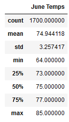
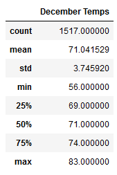

# Surfs Up with SQLite, SQLAlchemy, and Flask

## Overview of the Analysis - Purpose

We are trying to determine if the temperature and weather are right for an ice cream shop in Hawaii. After creating a flask server that uses SQLAlchemy to query data in a JSON format from our SQLite database, we need some more analysis. W. Avy wanted to know about temperature trends year round, specifically the months of June and December in Oahu. If it looks good, then an ice cream shop business will likely be sustainable year-round. 

## Results

 

We can see the summary statistics of Oahu temperatures in both June and December above. Here are some of the major takeaways:
  - The mean temperature for June is 74.9 degrees fahrenheit and December is 71.0 degrees. Therefore, Oahu seems to stay pleasantly warm year round. 
  - The standard deviation is only 3.2 for June and 3.7 for December. This means that the vast majority of days will be in the mid 60s to low 80s throughout these months. 
  - The high for June and December are 85 and 83 degrees respectively, which aren't too hot. The lows are 64 and 56 degrees respectively. While these temperatures may be getting a little too chilly for ice cream, they're the minimum and aren't too bad. 

## Summary

Based on these results Oahu seems to stay mostly slightly chilly, warm, or hot year round. An ice cream shop business would likely do well on most days year round, even into the winter. An extra query that would be useful would be to check for precipitation each month. People may not eat as much ice cream if it's raining every day, regardless of the temperature. Another query could group the temperature and precipitation data by each station to see which ones look best. Oahu has mountains that may effect the temperature and rain on both sides of the island. 
